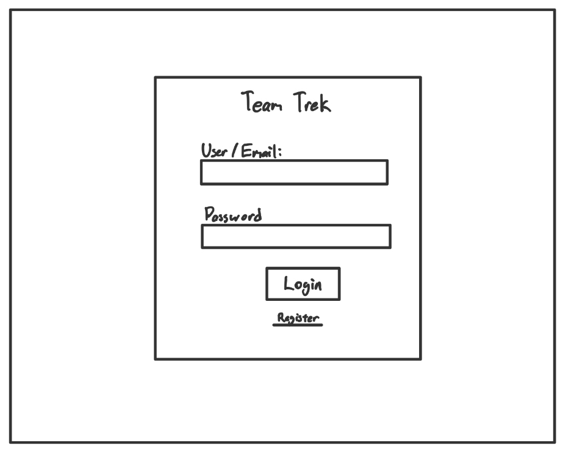
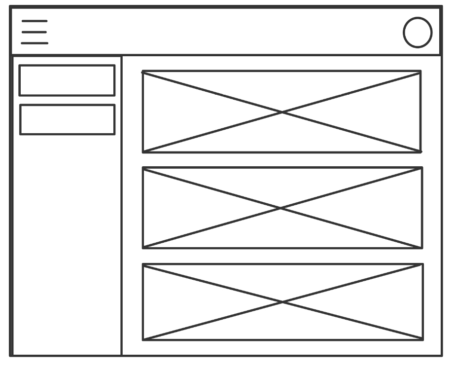
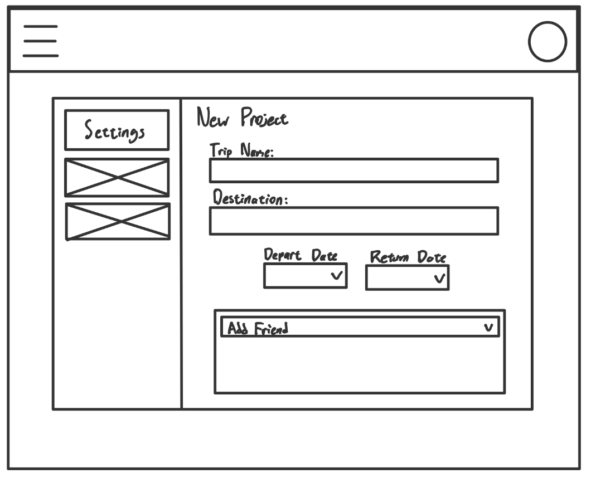
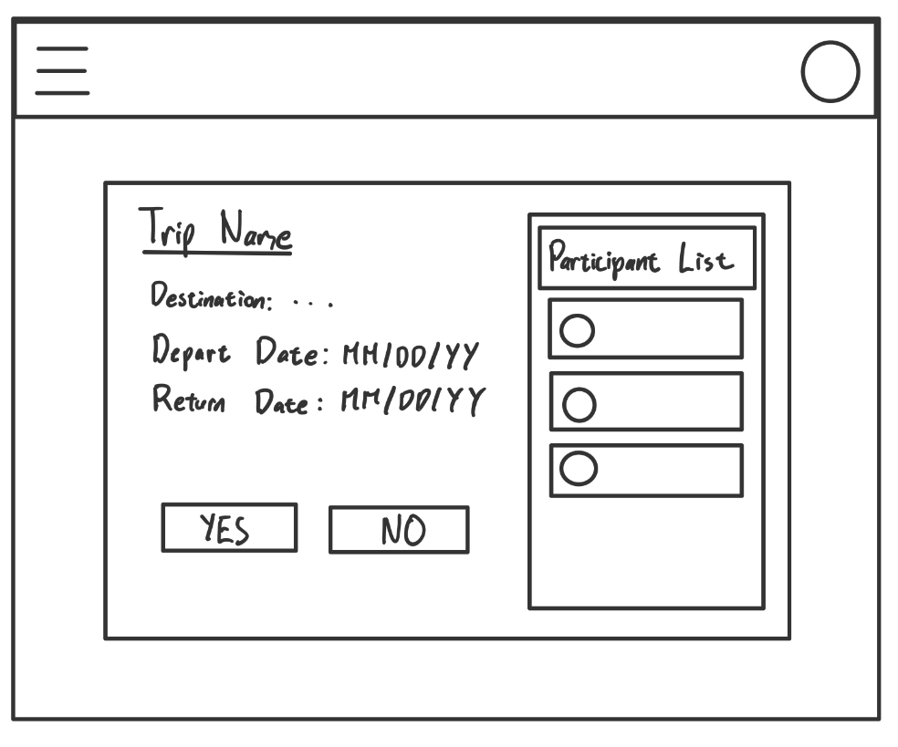
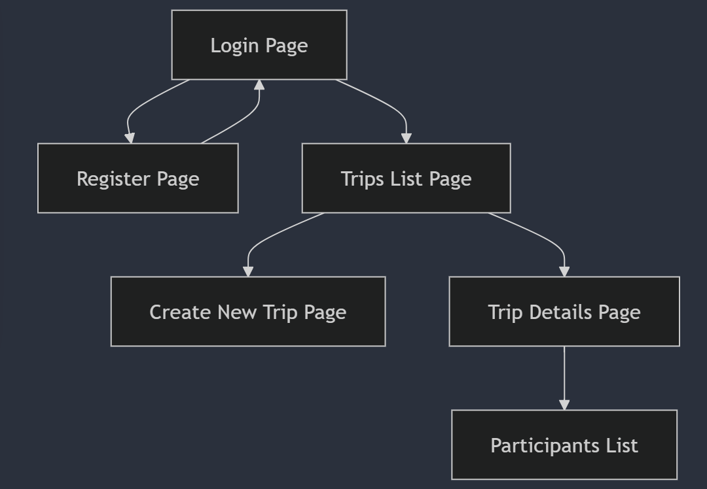

The content below is an example project proposal / requirements document. Replace the text below the lines marked "__TODO__" with details specific to your project. Remove the "TODO" lines.


# Team Trek 

## Overview

(__TODO__: a brief one or two paragraph, high-level description of your project)

TeamTrek is a group trip planner designed to help groups coordinate and plan their travel itineraries with ease. Users will be able to create trip groups, invite friends, build itineraries, and vote on activity preferences. The goal is to reduce the hassle of group planning by consolidating all trip logistics and group communication into one application.


## Data Model


The application will store Users and Trips

* Users can have multiple friends (reference)
* Users can have multiple Trips (reference)
* Trips can have multiple participants (embedding)
* Trips must have one organizer (reference)
* Trips must have a name & destination (reference)
* Trips must have a start and end date (reference)


(__TODO__: sample documents)

An Example User:

```javascript
{
  "username": "traveler_0",
  "hash": // a password hash
  "email": "traveler_0@gmail.com",
  "friends": ["username1", "username1"], 
  "trips": ["trip1", "trip2"]
}

```

An Example Trip

```javascript
{
  "organizer": "username1",
  "name": "European Escape",
  "destination": "Italy",
  "dates": {
    "start": "2025-04-11",
    "end": "2025-04-25"
  },
  "participants": ["username2", "username3"]
}
```


## [Link to Commented First Draft Schema](db.mjs) 

(__TODO__: create a first draft of your Schemas in db.mjs and link to it)

## Wireframes

(__TODO__: wireframes for all of the pages on your site; they can be as simple as photos of drawings or you can use a tool like Balsamiq, Omnigraffle, etc.)

/login - login page



/trips - page showing all user trips



/trips/create - page for creating a new trip



/trips/slug - page for viewing details of a specific trip, such as participants




## Site Map


## User Stories or Use Cases

(__TODO__: write out how your application will be used through [user stories](http://en.wikipedia.org/wiki/User_story#Format) and / or [use cases](https://en.wikipedia.org/wiki/Use_case))

1. as a non-registered user, I can register a new account.
2. as a user, I can log in to my account.
3. as a user, I can create a new trip and invite friends.
4. as a user, I can view, edit, and delete my trips.


## Research Topics

(__TODO__: the research topics that you're planning on working on along with their point values... and the total points of research topics listed)

* (5 points) Integrate user authentication
    * I'm going to be using passport for user authentication
* (5 points) react.js
    * used react.js as the frontend framework; it's a challenging library to learn, so I've assigned it 5 points

10 points total out of 8 required points 

## [Link to Initial Main Project File](app.mjs) 

(__TODO__: create a skeleton Express application with a package.json, app.mjs, views folder, etc. ... and link to your initial app.mjs)

## Annotations / References Used

(__TODO__: list any tutorials/references/etc. that you've based your code off of)

1. [passport.js authentication docs](https://www.passportjs.org/docs/) 
2. [tutorial on react.js](https://react.dev/learn) 
3. [mongoose documentation](https://mongoosejs.com/docs/guide.html)

